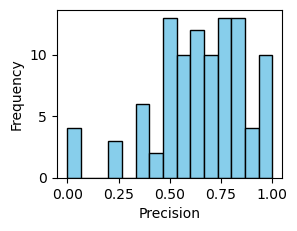

### CSE150A Project Milestone 4
Dataset: https://www.kaggle.com/datasets/grouplens/movielens-20m-dataset/data

## Describe your dataset (4pts):
Our dataset is a list of movies with titles and genres with ratings by 138493 users between January 09, 1995 and March 31, 2015. We want to recommend to the user the best movie(s) given what movies the user has already watched. The data is relevant to probabilistic modeling because the user inputs are undetermined, and we can use the random user inputs to predict the next result. Our data will be preprocessed by parsing the movies into a dictionary, where keys are genres and values are arrays of movies with that genre. Also filter out movies with no genres.
The dataset has 27.3k entries and is reasonably processable. The dataset we are using is from MovieLens. It is randomly sampled and reliable. The data is categorical.
“The datasets describe ratings and free-text tagging activities from MovieLens, a movie recommendation service. It contains 20000263 ratings and 465564 tag applications across 27278 movies. These data were created by 138493 users between January 09, 1995 and March 31, 2015. This dataset was generated on October 17, 2016. Users were selected at random for inclusion. All selected users had rated at least 20 movies.”
	
## Project Proposal:
Our model should find the best movie recommendations based on the movies recently watched by the user. Uncertainty modeling is important because recommending movies isn’t objective and is subjective to what the user values. In this context, non-probabilistic approaches don’t take into account how users often choose movies with little to no relation to movies previously watched.

## Agent in terms of PEAS:
Performance measure: Accuracy depending on user, recall, and precision
Environment: Terminal or code editor
Actuators: Screen/text output
Sensors: User input / list of movies watched

## Methodology:
We are using a Naïve Bayes model. We will use maximum likelihood to calculate CPT values, since we are using a naive bayes model. We will assume that movies with no genres won’t be chosen and will never be recommended. We will also assume that there will be an optimal recommendation. To evaluate our model, we will do an 80/20 train/test split and evaluate performance metrics.


## Agent Setup, Data Preprocessing, Training setup (15pts)
In the dataset, we are utilizing two main files: u.item and u.data.
- u.item: pipe-separated; first 5 cols + 19 genre flags
- u.data: tab-separated userId | movieId | rating | timestamp


The variables that are important to the model from these files are as follows:
- userId (int)
  - A user’s unique identifier, used to get a specific person’s ratings for the model and also used for the train test split

- movieId (int)
  - A movie’s unique identifier, used to link the tables from u.item and u.data
rating (1 or 0; liked or disliked)

- rating (1 or 0)
  - A rating from 1-5 that is binarized to liked if the rating is 4 or 5, and disliked if 1, 2, or 3

- genres (binary vector for each movie)
  - 19 binary columns (e.g. Action, Comedy, Drama). Each column is 1 if the movie belongs to that genre. These are the main features for the Naive Bayes classifier.

  We predict the user preferences using naïve bayes classification. The Naïve Bayes model assumes that each feature is conditionally independent given y (liked/disliked). We picked naïve bayes because our data is categorical, and the independence assumption is reasonable for genres. We calculate the CPTS with bayes formula, calculating p(y|X) where X is the feature vector of the genres of a movie, then taking the highest value between p(y=1 | X) and p(y=0 | X) to classify a movie as liked or disliked. Below are the equations.


1. Prior probability of liked \(y\):

$$
P(y) = \frac{\text{Number of movies liked } y}{\text{Total number of movies rated}}
$$

2. Conditional probability of features \(X\) given liked \(y\) (assuming feature independence):

$$
P(X \mid y) = \prod_{i=1}^n P(x_i \mid y)
$$

where

$$
P(x_i \mid y) = \frac{1 + \text{count of movies where } x_i \text{ is present and liked } y}{1 + \text{total count of movies liked } y}
$$

*(Laplace smoothing is applied to avoid zero probabilities)*

3. Posterior probability of liked \(y\) given features \(X\):

$$
P(y \mid X) \propto P(y) \times \prod_{i=1}^n P(x_i \mid y)
$$

4. Prediction rule:

$$
\hat{y} = \arg\max_{k \in \{1, \ldots, K\}} p(C_k) \prod_{i=1}^{n} p(x_i \mid C_k)
$$


## Train your model! (5pts)
Below is a snippet of the main naive bayes logic. You can also find it in the notebook: [View milestone4.ipynb](./milestone4.ipynb)


```
movies_final = movies.drop(['title', 'release_date', 'video_release_date', 'IMDb_URL'], axis = 1).set_index('movieId')
user_rating = ratings[ratings['userId'] == 1]
user_rating_cleaned = user_rating.reset_index()[['movieId', 'rating']]
user_rating_cleaned['rating'] = user_rating_cleaned['rating'].isin([4,5])
user_rating_cleaned


def p_X_given_y(row, reviews): #returns P(x_1 | y), P(x_2 | y), P(x_3 | y)...
    matches = (reviews.values == row.values).sum(axis=0)
    return (1 + matches) / (1 + len(reviews))  #P(X | y) = count(X, y) / count(y), with laplace smoothing

def p_y_given_X(row, movies_final, ratings_final): #P(y | X) ∝ P(Y) * ∏ P(X | y)
    p_y = ratings_final['rating'].mean() #P(Y) = count(Y) / count(All)
    good_review_ids = ratings_final[ratings_final['rating']]['movieId']
    p_X_given_y_vector = p_X_given_y(row, movies_final.loc[good_review_ids]) #P(x_1 | y), P(x_2 | y), P(x_3 | y)...
    return p_y * p_X_given_y_vector.prod() #P(y | X) ∝ P(Y) * ∏ P(x_i | y)

def p_y_0_given_X(row, movies_final, ratings_final): #P(y | X) ∝ P(Y) * ∏ P(X | y)
    p_y = 1 - ratings_final['rating'].mean() #P(Y) = count(Y) / count(All)
    bad_review_ids = ratings_final[~ratings_final['rating']]['movieId']
    p_X_given_y_vector = p_X_given_y(row, movies_final.loc[bad_review_ids]) #P(x_1 | y), P(x_2 | y), P(x_3 | y)...
    return p_y * p_X_given_y_vector.prod() #P(y | X) ∝ P(Y) * ∏ P(x_i | y)

# compute P(y|X) for all unwatched movies
# accepts as input the whole dataframe of all movies(final_df), and the dataframe of all watched movies by the user(watched_df)
def naive_bayes(movies_final, user_rating_cleaned):
    unwatched_df = movies_final[~movies_final.index.isin(user_rating_cleaned['movieId'])].copy()
    p_y_given_X_col = unwatched_df.apply(p_y_given_X, axis = 1, args = (movies_final, user_rating_cleaned))
    p_y_0_given_X_col = unwatched_df.apply(p_y_0_given_X, axis = 1, args = (movies_final, user_rating_cleaned))
    unwatched_df['p_y_given_X'] = p_y_given_X_col
    unwatched_df['p_y_0_given_X'] = p_y_0_given_X_col
    unwatched_df['pred_rating'] = (unwatched_df['p_y_given_X'] > unwatched_df['p_y_0_given_X']).astype(int)
    return unwatched_df.sort_values(by = 'p_y_given_X', ascending = False)[['p_y_given_X', 'pred_rating']]
    
naive_bayes(movies_final, user_rating_cleaned)  # Randomly select 20% of the DataFrame as watched
```

### Conclusion/Results (15pts)
To estimate our performance, we got the precision, recall, and accuracy scores of 100 random users using the scikit-learn library. We graphed the results in a histogram, and also calculated the averages, as shown below. 




```
Means from above training:
Precision: 0.6428
Recall: 0.6507
Accuracy: 0.6109
```

####  **Precision**  
> *Out of the movies our model predicted the user would like, how many did they actually like?*

**Interpretation:**  
A high precision means we make fewer false recommendations. Our score of **0.6428** means that about **64%** of the time, when the model predicts a user will like a movie, they actually do.

---

####  **Recall**  
> *Out of all the movies the user actually liked, how many did our model successfully recommend?*


**Interpretation:**  
A high recall means we recommend more movies successfully. Our score of **0.6507** means that we successfully recommended about **65%** of the movies users liked.

---

####  **Accuracy**  
> *Out of all movies, how many times did the model predict correctly whether the user would like or dislike them?*


**Interpretation:**  
Our model was overall correct about **61%** of the time when predicting whether a user would like or dislike a movie.

Guessing randomly would have approximately a 50% precision, recall, and accuracy score, so having scores of about 65% is very good.

### Possible improvement:
Instead of making ratings binary, use the actual rating value in our calculations.