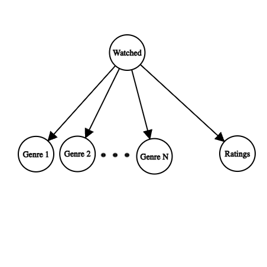

### CSE150A Project Milestone 2
Dataset: https://www.kaggle.com/datasets/grouplens/movielens-20m-dataset/data

## Describe your dataset (4pts):
Our dataset is a list of movies with titles and genres with ratings by 138493 users between January 09, 1995 and March 31, 2015. We want to recommend to the user the best movie(s) given what movies the user has already watched. The data is relevant to probabilistic modeling because the user inputs are undetermined, and we can use the random user inputs to predict the next result. Our data will be preprocessed by parsing the movies into a dictionary, where keys are genres and values are arrays of movies with that genre. Also filter out movies with no genres.
The dataset has 27.3k entries and is reasonably processable. The dataset we are using is from MovieLens. It is randomly sampled and reliable. The data is categorical.
“The datasets describe ratings and free-text tagging activities from MovieLens, a movie recommendation service. It contains 20000263 ratings and 465564 tag applications across 27278 movies. These data were created by 138493 users between January 09, 1995 and March 31, 2015. This dataset was generated on October 17, 2016. Users were selected at random for inclusion. All selected users had rated at least 20 movies.”
	
## Project Proposal:
Our model should find the best movie recommendations based on the movies recently watched by the user. Uncertainty modeling is important because recommending movies isn’t objective and is subjective to what the user values. In this context, non-probabilistic approaches don’t take into account how users often choose movies with little to no relation to movies previously watched.

## Agent in terms of PEAS:
Performance measure: Accuracy depending on user
Environment: Terminal or code editor
Actuators: Screen/text output
Sensors: User input / list of movies watched

## Methodology:
We are using a Naïve Bayes model. We will use maximum likelihood to calculate CPT values, since we are using a naive bayes model. We will assume that movies with no genres won’t be chosen and will never be recommended. We will also assume that there will be an optimal recommendation. To evaluate our model, we will split our data and give the model some of the movies that each user has watched and rated to predict what movie they should watch next, and if the output is a movie that the user has watched that we didn’t give the model, we mark a pass, and if not, we mark a fail, and judge based on the percentage of passes.

### CSE150A Project Milestone 3
Dataset: https://grouplens.org/datasets/movielens/100k/

## PEAS/Agent Analysis (5pts):
Performance measure: Accuracy depending on user
Environment: Terminal or code editor
Actuators: Screen/text output
Sensors: User reviews and input data

Our model should find the best movie recommendations based on the movies recently watched by the user. Uncertainty modeling is important because recommending movies isn’t objective and is subjective to what the user values. In this context, non-probabilistic approaches don’t take into account how users often choose movies with little to no relation to movies previously watched.

## Agent Setup, Data Preprocessing, Training setup (10pts)
The only import we used was Pandas, which is python's standard data manipulation library.

The dataset consists of one CSV file for user ratings by movie ID and another that contains titles, release dates, and boolean values for genres in the dataset. Using these CSV files we made a dataframe consisting of average ratings by movies and boolean values for genre. In all, our model contains variables for each genre (True or False), ratings (1-5), and whether a movie has been watched by the user (True or False). Under the the Naive Bayes model, each variable is dependent on whether a particular movie has been watched by the user. For our model, we are trying to calculate the probability a movie has been watched given the individual features for the movie. The reason we used a Naive Bayes model is because it is a classification model that is highly scalable for more data, which allows us to easily improve on our baseline model in the next steps of our implementation. 
To calculate the CPTs:
P(watched | features) ∝ P(features | watched) * P(watched) 
where P(features | watched) = ∏ P(feature | watched)
and P(feature | watched) = count(feature and watched) / count(watched)

A picture of our model is shown below:

## Train your model! (5pts)
See the [Model Implementation section](milestone3.ipynb#model-implementation) in the notebook.

## Conclusion/Results (15pts)
We tested our model with our own testbenches, where we input movies that had similarities and judged the output on whether they all had the same similarities. 
One example was inputting three movies that all had the animation genre, but with different ratings. Since the ratings are weighted the same as the genre, and the comparison algorithm isn’t implemented correctly, our output differed from what we expected.

But for more easy tasks, such as movies with the same rating and the same genre, our output was as expected.

## Points of Improvement
- Weigh the ratings heavier
- Change rating comparison to check if the rating of the movie is greater than or equal to 4, or if it is within 1 star from the user's rating
- Incorporate year the movie was released and add movies within 10 years of the release date of the compared movie
